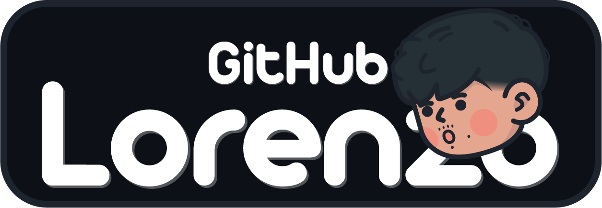

 

	

<h3 align="center">⚡Embedded Systems Engineering Student⚡</h3>
								
 	

# 🔭 About me

Hi! I’m a french Engineering Student at **[ECE Paris](https://www.ece.fr/)**, an Electronics engineering school where I specialize in Embedded Systems. 
I'm interested in various fields, including aerospace, robotics and machine learning.

I'm currently on an internship at **[Parrot](https://www.parrot.com/fr)** as a Test and Functional Validation Engineer.

 	

# 🌱 My Skills
## Software Development
### C / C++ / Python / Arduino / Git / Cmake / Bash / Ada

## Back-end Web
### Python / Nodejs / SQL / Git

## Machine Learning
### Python / PyTorch / Tensorflow / Keras

## Hardware Development
### Raspberrypi / Assembly / FPGA / VHDL

## Design
### After Effects / Illustrator / Phostoshop / Blender / sharp3D

## Tools
### VsCode / Notion / GitHub / Anaconda / Clion

 

# 📫 Contact

	
	&nbsp;
	
	&nbsp;

<!--
**MrZouu/MrZouu** is a ✨ _special_ ✨ repository because its `README.md` (this file) appears on your GitHub profile.

Here are some ideas to get you started:

- 🔭 I’m currently working on ...
- 🌱 I’m currently learning ...
- 👯 I’m looking to collaborate on ...
- 🤔 I’m looking for help with ...
- 💬 Ask me about ...
- 📫 How to reach me: ...
- 😄 Pronouns: ...
- ⚡ Fun fact: ...
-->
