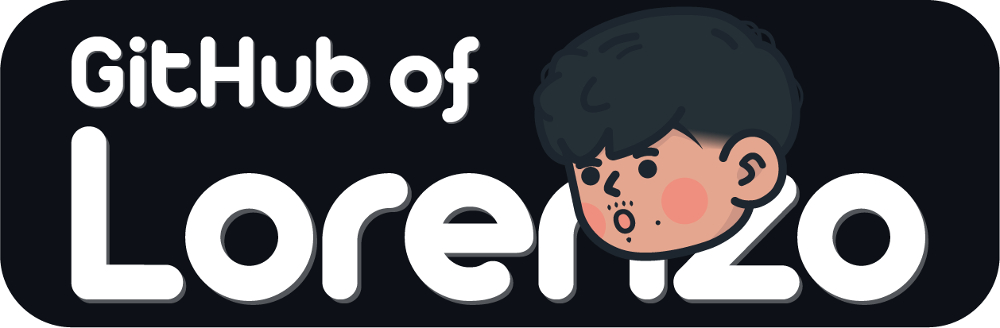

 

	

<h3 align="center">⚡Embedded Systems Engineering Student⚡</h3>
								
 	

# 🔭 About me

Hi! I’m a french Engineering Student at **[ECE Paris](https://www.ece.fr/)**, an Electronics engineering school where I specialize in Embedded Systems. 
I'm interested in various fields, including aerospace, robotics and machine learning.

I'm currently on an internship at **[Airbus](https://www.airbus.com/en)**.

 

More informations on my website: **[lorenzomarrocchi.com](https://lorenzomarrocchi.com/)**

 

# 📂 Projects
## [🤿 Bluexplorer. • 2025](https://github.com/MrZouu/Bluexplorer.)

This project is a low-cost underwater drone designed for research, education, and experimentation, integrating real-time video streaming.

	

 

## [🤘 SmoothTalk • 2024](https://github.com/MrZouu/SmoothTalk)

This project is a Sign language interpreter, to switch from a video signal to a corresponding word. This machine-learning project, powered by PyTorch, aims to develop a sign language recognition system.

	

 

## [🌐 Portfolio • 2024](https://github.com/MrZouu/Portfolio)

This project is a website portfolio created to introduce myself and showcase my computer science projects. It's a responsive website built using HTML, CSS, and JavaScript.

	

 

## [📻 Radio-Transmitter • 2024](https://github.com/MrZouu/Radio-Transmitter)

This project is an Arduino-based remote control system designed for wirelessly piloting various projects, including drones, robots, and more.

	

 

## [⚓ Battleship • 2022](https://github.com/MrZouu/Battleship)

This project is a simplified console version of the board game Battleship.

	

 

# 📫 Contact

	
	
	
	

<!--
**MrZouu/MrZouu** is a ✨ _special_ ✨ repository because its `README.md` (this file) appears on your GitHub profile.

Here are some ideas to get you started:

- 🔭 I’m currently working on ...
- 🌱 I’m currently learning ...
- 👯 I’m looking to collaborate on ...
- 🤔 I’m looking for help with ...
- 💬 Ask me about ...
- 📫 How to reach me: ...
- 😄 Pronouns: ...
- ⚡ Fun fact: ...
-->
